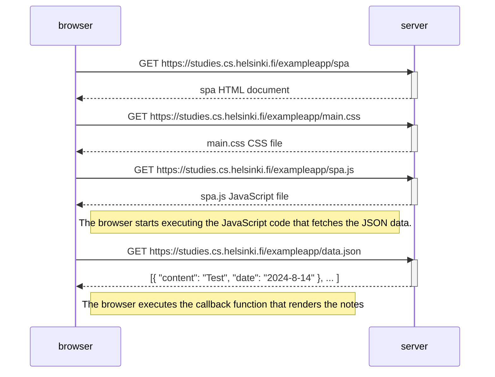

```mermaid

sequenceDiagram
    participant browser
    participant server

    browser->>server: GET https://studies.cs.helsinki.fi/exampleapp/spa
    activate server
    server-->>browser: spa HTML document
    deactivate server

    browser->>server: GET https://studies.cs.helsinki.fi/exampleapp/main.css
    activate server
    server-->>browser: main.css CSS file
    deactivate server

    browser->>server: GET https://studies.cs.helsinki.fi/exampleapp/spa.js
    activate server
    server-->>browser: spa.js JavaScript file
    deactivate server

    Note right of browser: The browser starts executing the JavaScript code that fetches the JSON data.

    browser->>server: GET https://studies.cs.helsinki.fi/exampleapp/data.json
    activate server
    server-->>browser:[{ "content": "Test", "date": "2024-8-14" }, ... ]
    deactivate server

    Note right of browser: The browser executes the callback function that renders the notes
    
```